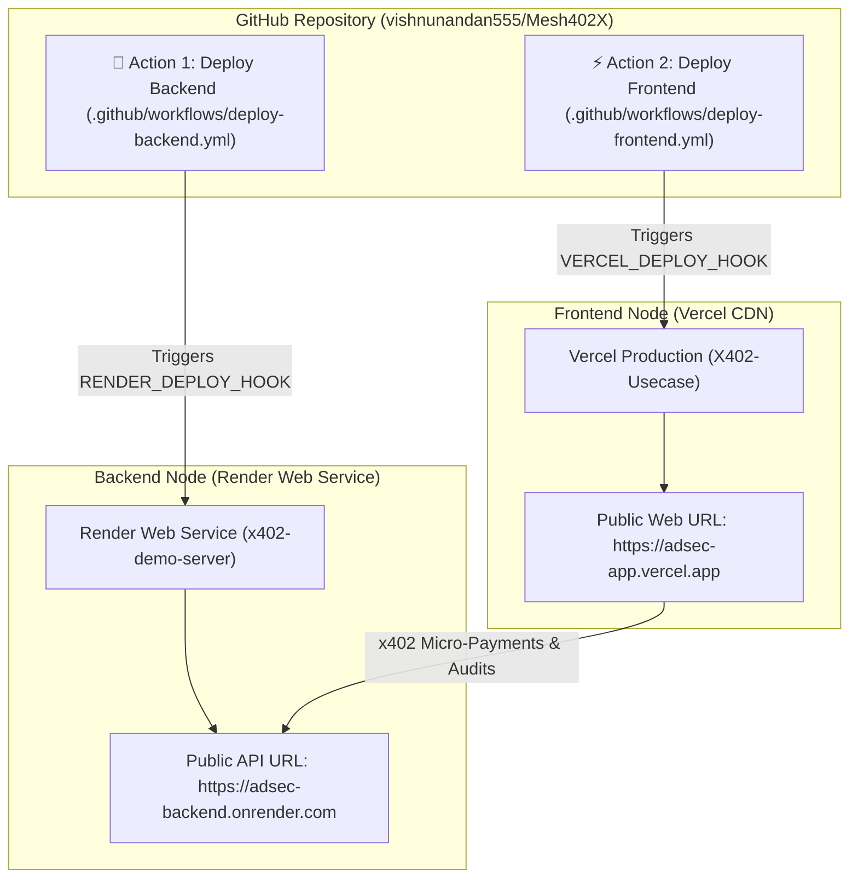

> **Architecture:**  
> • **Backend:** Render Web Service (`x402-demo-server` Hono Node.js Server)  
> • **Frontend:** Vercel Static Site (`X402-Usecase` React Vite App)  
> • **CI/CD:** 2 Separate Manual GitHub Actions (`deploy-backend.yml` & `deploy-frontend.yml`) — *Only runs when you manually click "Run workflow" in GitHub UI!*

---

## 🏗️ Deployment Architecture

---

## 🛠️ STEP 1: Deploy Backend (`x402-demo-server`) on Render

Render hosts the long-running Hono Node.js server with unlimited execution time for LLM calls and OSV.dev queries.

### 1.1 Create Web Service on Render:
1. Log into [dashboard.render.com](https://dashboard.render.com/) with GitHub.
2. Click **New +** ➔ **Web Service**.
3. Connect your repository: **`vishnunandan555/Mesh402X`**.
4. Fill in the build parameters:
   * **Name:** `adsec-backend`
   * **Region:** Oregon (US West) or Frankfurt (EU)
   * **Branch:** `main`
   * **Root Directory:** `x402-Project/x402-demo-server`
   * **Runtime:** `Node`
   * **Build Command:** `npm install`
   * **Start Command:** `npm start`
   * **Instance Type:** `Free`

### 1.2 Add Environment Variables in Render:
Scroll down to **Environment Variables** and click **Add Environment Variable**:

| Variable Name | Value | Required / Optional |
| :--- | :--- | :--- |
| **`AVM_ADDRESS`** | Your friend's Receiver Algorand TestNet Public Address | **REQUIRED** |
| **`FACILITATOR_URL`** | `https://facilitator.goplausible.xyz` | **REQUIRED** |
| **`PORT`** | `4021` | **REQUIRED** |
| **`GROQ_API_KEY`** | `gsk_...` (Free at [console.groq.com](https://console.groq.com)) | *Optional (Fast <300ms LLM)* |
| **`GEMINI_API_KEY`** | `AIza...` (Free at Google AI Studio) | *Optional (Gemini 1.5 Flash)* |
| **`OPENAI_API_KEY`** | `sk-...` | *Optional (GPT-4o-mini)* |

5. Click **Create Web Service**.
6. Once deployed, copy your Live Backend URL (e.g. `https://adsec-backend.onrender.com`).

---

## ⚡ STEP 2: Deploy Frontend (`X402-Usecase`) on Vercel

Vercel serves the React UI across edge CDNs in <50ms.

### 2.1 Import Project into Vercel:
1. Log into [vercel.com/new](https://vercel.com/new) with GitHub.
2. Select your repository: **`vishnunandan555/Mesh402X`**.
3. Configure the framework settings:
   * **Framework Preset:** `Vite`
   * **Root Directory:** `x402-Project/X402-Usecase/projects/X402-Usecase`
   * **Build Command:** `npx vite build`
   * **Output Directory:** `dist`

### 2.2 Add Environment Variables in Vercel:
Add the following under **Environment Variables**:

| Variable Name | Value |
| :--- | :--- |
| **`VITE_API_BASE_URL`** | `https://adsec-backend.onrender.com` (Your Render backend URL) |
| **`VITE_FACILITATOR_URL`** | `https://facilitator.goplausible.xyz` |
| **`VITE_ALGOD_SERVER`** | `https://testnet-api.algonode.cloud` |
| **`VITE_ALGOD_NETWORK`** | `testnet` |

4. Click **Deploy**.
5. Copy your Live Web App URL (e.g. `https://adsec-app.vercel.app`).

---

## 🔑 STEP 3: Setup 2 Separate GitHub Actions Deploy Hooks

To enable manual **"Run workflow"** buttons under GitHub Actions for both backend and frontend:

### 3.1 Get Render Deploy Hook (Backend):
1. In Render Dashboard (`adsec-backend`), go to **Settings** ➔ scroll to **Deploy Hook**.
2. Copy the hook URL (e.g. `https://api.render.com/deploy/srv-c123456?key=abc...`).
3. In GitHub Repo: `Settings` ➔ `Secrets and variables` ➔ `Actions` ➔ **New repository secret**.
   * **Name:** `RENDER_DEPLOY_HOOK`
   * **Secret:** Paste the Render URL.

### 3.2 Get Vercel Deploy Hook (Frontend):
1. In Vercel Dashboard (`adsec-app`), go to **Settings** ➔ **Git** ➔ **Deploy Hooks**.
2. Click **Create Hook** (Name: `github-actions-deploy`, Branch: `main`).
3. Copy the hook URL (e.g. `https://api.vercel.com/v1/integrations/deploy/prj_123...`).
4. In GitHub Repo: `Settings` ➔ `Secrets and variables` ➔ `Actions` ➔ **New repository secret**.
   * **Name:** `VERCEL_DEPLOY_HOOK`
   * **Secret:** Paste the Vercel URL.

Now under the **Actions** tab in GitHub, you will see **2 separate deployment actions**:
* 🚀 **`Deploy Backend to Render`**
* ⚡ **`Deploy Frontend to Vercel`**

---

## ⏰ STEP 4: Keep-Alive Ping (Prevent Render Cold Starts)

Render free tier sleeps after 15 minutes. Keep it 100% active for judges:

1. Open [cron-job.org](https://cron-job.org/en/) (Free).
2. Create cron job:
   * **URL:** `https://adsec-backend.onrender.com/health`
   * **Schedule:** Every 10 minutes.
3. Your server will stay warm and respond instantly during live pitch Q&A!
