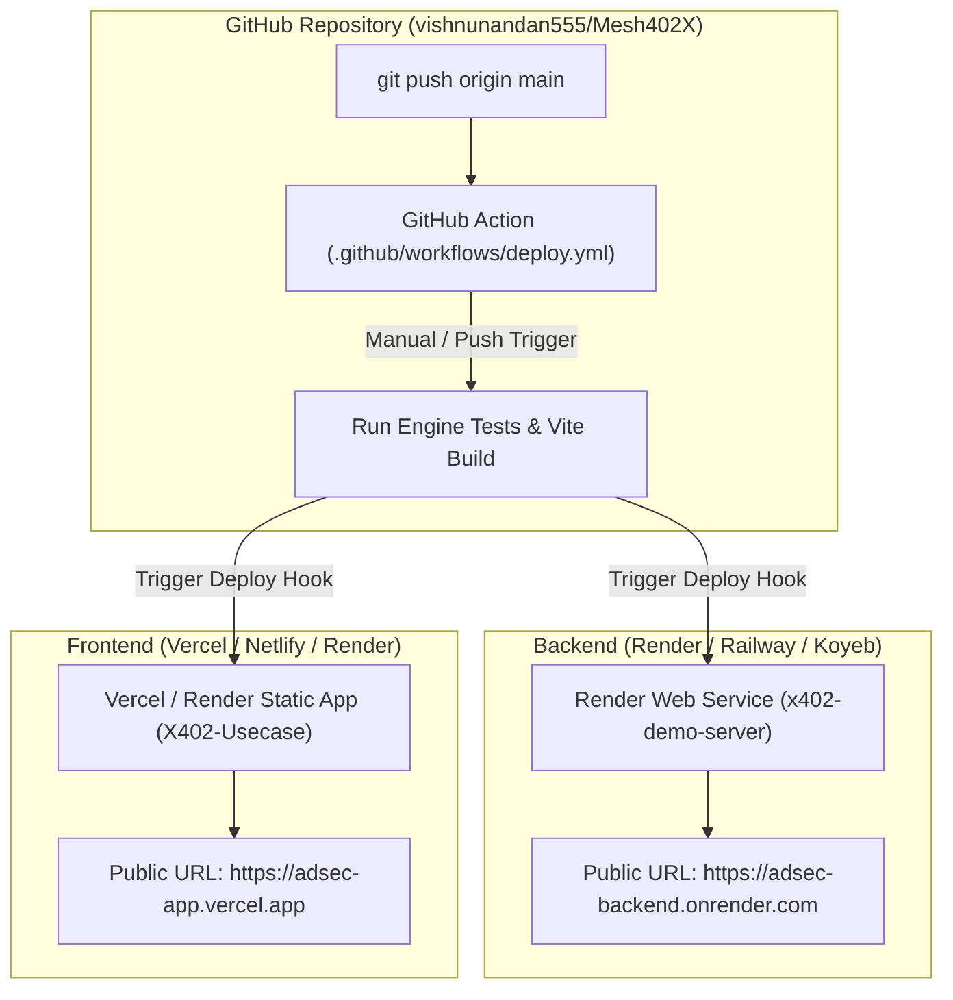

# 🌐 ADSEC — Complete Cloud Hosting & Auto-Deploy Guide

> **Goal:** Deploy the ADSEC Hono backend (`x402-demo-server`) and React frontend (`X402-Usecase`) to free cloud hosting with automated GitHub Actions deployment.

---

## 🏗️ Deployment Architecture



---

## ⚡ STEP 1: Deploy Backend (`x402-demo-server`) to Render (Free Tier)

Render provides free Node.js Web Service hosting that automatically connects to your GitHub repository.

### Steps:
1. Go to [dashboard.render.com](https://dashboard.render.com/) and log in with GitHub.
2. Click **New +** ➔ **Web Service**.
3. Select your repository: **`vishnunandan555/Mesh402X`**.
4. Configure the settings:
   * **Name:** `adsec-backend` (or your choice)
   * **Region:** Oregon (US West) or Frankfurt (EU)
   * **Branch:** `main`
   * **Root Directory:** `x402-Project/x402-demo-server`
   * **Runtime:** `Node`
   * **Build Command:** `npm install`
   * **Start Command:** `npm start` (or `npx tsx index.ts`)
   * **Instance Type:** `Free`

5. **Set Environment Variables in Render:**
   Scroll down to **Environment Variables** and add:
   ```env
   AVM_ADDRESS=YOUR_ALGORAND_TESTNET_RECEIVER_ADDRESS
   FACILITATOR_URL=https://facilitator.goplausible.xyz
   PORT=4021
   GROQ_API_KEY=optional_groq_key_here
   GEMINI_API_KEY=optional_gemini_key_here
   ```
6. Click **Create Web Service**.
7. Copy your backend URL (e.g. `https://adsec-backend.onrender.com`).

---

## ⚡ STEP 2: Deploy Frontend (`X402-Usecase`) to Vercel / Netlify / Render

### Option A: Vercel (Recommended — Sub-second CDN)
1. Go to [vercel.com/new](https://vercel.com/new) and log in with GitHub.
2. Import repository **`vishnunandan555/Mesh402X`**.
3. Configure project settings:
   * **Framework Preset:** `Vite`
   * **Root Directory:** `x402-Project/X402-Usecase/projects/X402-Usecase`
   * **Build Command:** `npx vite build`
   * **Output Directory:** `dist`
4. **Set Environment Variables:**
   ```env
   VITE_ALGOD_SERVER=https://testnet-api.algonode.cloud
   VITE_ALGOD_NETWORK=testnet
   VITE_API_BASE_URL=https://adsec-backend.onrender.com
   VITE_FACILITATOR_URL=https://facilitator.goplausible.xyz
   ```
5. Click **Deploy**.

---

## ⚡ STEP 3: Setup GitHub Actions Auto-Deploy ("Run Action" Button)

To enable automatic deployment when pushing code or clicking **"Run workflow"** in GitHub:

1. **Get Render Deploy Hook URL:**
   * In your Render dashboard (`adsec-backend`), go to **Settings** ➔ scroll down to **Deploy Hook**.
   * Copy the URL (e.g. `https://api.render.com/deploy/srv-c123456?key=abc...`).
2. **Add Secret to GitHub:**
   * Go to your GitHub repository: `https://github.com/vishnunandan555/Mesh402X/settings/secrets/actions`
   * Click **New repository secret**.
   * **Name:** `RENDER_DEPLOY_HOOK`
   * **Secret:** Paste the Render deploy hook URL.
   * Click **Add secret**.

Now, whenever you click **"Run workflow"** under GitHub Actions tab or push to `main`, GitHub Actions will verify tests and trigger cloud deployment automatically!

---

## ⏰ STEP 4: Keep-Alive Ping (Prevent Render Cold Starts)

Render's free tier sleeps after 15 minutes of inactivity. To keep your live server awake during hackathon demos:

1. Open [cron-job.org](https://cron-job.org/en/) (Free).
2. Create a new cron job:
   * **URL:** `https://adsec-backend.onrender.com/health`
   * **Schedule:** Every 10 minutes.
3. Your server will stay 100% active and respond in <200ms instantly!
