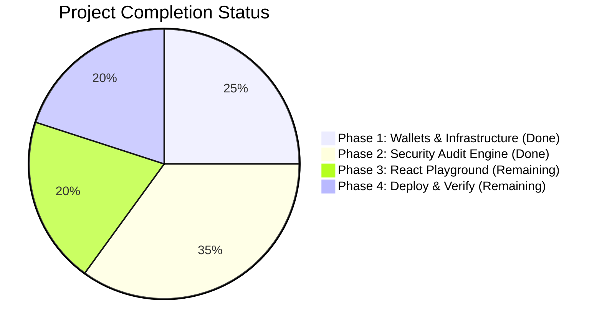

# ADSEC — Master Checklist & Progress Tracker

> **Project:** ADSEC (Autonomous Decentralized Security Audit Node)  
> **Framework:** Hono Backend + React (Vite) Frontend on Algorand TestNet via GoPlausible Facilitator  
> **Architecture:** Paid Backend Engine (`x402-demo-server`) + Payment Flow Playground (`X402-Usecase`)  
> **Goal:** 100/100 points on Technical Judging Criteria (Live x402 on TestNet, GoPlausible facilitator, OSV.dev CVE + LLM Diff Engine, React Playground + Receipts Ledger).

---

## 📊 Summary Progress

- [x] **Phase 1: Environment & Wallet Infrastructure** (Completed)
- [x] **Phase 2: Core ADSEC Security Engine (Backend)** (Completed)
- [ ] **Phase 3: Interactive React Playground & Live On-Chain Integration** (Remaining — 0/4 tasks)
- [ ] **Phase 4: Cloud Deployment, Bazaar Verification & Pitch Prep** (Remaining — 0/4 tasks)

---

## 🟢 What is DONE

### Phase 1: Environment & Wallet Infrastructure ✅
- [x] Node.js LTS (v18+) and npm environment verified.
- [x] Official `x402-Project` template structure integrated into workspace.
- [x] Root `.gitignore` configured to protect all `.env` files, build directories, and keys.
- [x] Created two Algorand TestNet accounts on Lora (Payer for Agent, Receiver for ADSEC Server).
- [x] Funded both accounts with TestNet ALGO via Lora dispenser.
- [x] Opted both accounts into TestNet USDC (ASA `10458941`).
- [x] Funded Payer account with TestNet USDC via Circle faucet / Pera wallet transfer.
- [x] Configured `.env` in `x402-demo-server` and `.env.local` in `X402-Usecase`.
- [x] Standalone automated payment client added in `x402-Project/402-demo-client/` with balance checker and Algo25 generator.
- [x] **Live On-Chain x402 Settlement Verified**:
  - Payer: `BLZQISYSYJSO5UAQ4XYBI7YWSIJAW4TQ6XKL43WEXWYRCCXQU2S7AVCJMI`
  - Receiver: `LG24FUHIBJEL6Z3X7TPSOPGQKF6E2ZBLSZMNSFVOTSJA7TNETZTGCAQGDQ`
  - TxID: [`KYDRKTKYR4Y57L6DUQITC7CUZW2IUONHB5FIGMK5AJSB5ONSZRKQ`](https://lora.algokit.io/testnet/transaction/KYDRKTKYR4Y57L6DUQITC7CUZW2IUONHB5FIGMK5AJSB5ONSZRKQ) (Confirmed in round 66557283)

### Phase 2: Core ADSEC Security Engine (Backend) ✅
- [x] Defined TypeScript data contracts (`engine/types.ts`).
- [x] Built weighted 0–100 Security Health Score calculator (`engine/scoring.ts`).
- [x] Built regex secret scanner for AWS, OpenAI, GitHub PATs, JWTs, and private keys (`engine/tier1/secrets.ts`).
- [x] Built dangerous syntax analyzer for SQLi, `eval()`, `pickle.loads()`, and `os.system()` (`engine/tier1/patterns.ts`).
- [x] Built supply-chain package typosquatting checker using Levenshtein distance (`engine/tier1/typosquat.ts`).
- [x] Integrated live public OSV.dev CVE database lookup with line-level caller correlation (`engine/tier1/osv.ts`).
- [x] Built automated unified Git diff patch generator (`engine/tier2/diff-generator.ts`).
- [x] Built LLM semantic review wrapper (`engine/tier2/llm.ts`).
- [x] Created unified audit orchestrator pipeline (`engine/index.ts`).
- [x] Registered `POST /adsec/audit` with Bazaar discovery extension in `endpoints.config.ts`.
- [x] Created Hono endpoint handler (`handlers/adsec-audit.ts`) and wired into `index.ts`.
- [x] Built and verified Terminal Agent CLI (`scripts/agent-audit.ts`) with live 627ms execution.

---

## 🟡 What is LEFT (To Be Done)

### Phase 3: Interactive React Playground & Live On-Chain Integration ⏳
- [ ] **3.1 API Client Utility (`src/utils/adsecApi.ts`)**: Connect frontend to `/adsec/audit` via `@x402-avm/fetch` wrapper with Pera/Defly wallet signing.
- [ ] **3.2 Payment Flow Playground (`src/components/AdsecPlayground.tsx`)**: Build code editor with preloaded presets (*Python SQLi*, *Leaked AWS Key*, *CVE Vulnerability*), tier selector, and live 3-step payment status card.
- [ ] **3.3 Receipts Ledger (`src/components/ReceiptsLedger.tsx`)**: Build table tracking audit history with clickable links to the Algorand Lora Explorer.
- [ ] **3.4 App Navigation (`src/AppWithTabs.tsx`)**: Set ADSEC as the primary active tab in the main application.

### Phase 4: Cloud Deployment, Bazaar Verification & Pitch Prep ⏳
- [ ] **4.1 Cloud Deployment**: Deploy `x402-demo-server` to Render (free tier) and set environment variables.
- [ ] **4.2 Keep-Alive Setup**: Configure free ping on `cron-job.org` hitting `/health` every 10 minutes to prevent cold starts during demo.
- [ ] **4.3 Bazaar Discovery Check**: Query GoPlausible discovery registry to verify public indexing of our live domain.
- [ ] **4.4 Demo Backup & Pitch Prep**: Record a 60-second backup video clip of the payment and audit flow for presentation day.

---

## 🔮 Phase 5: High-Impact Feature Expansions (Roadmap)

See detailed specs in [**`features.md`**](file:///home/vishnunandan555/Projects/Mesh402X/features.md):
- [ ] **GitHub Repository Auditing (`repoUrl`)**: Ingest public repositories via GitHub REST API without git cloning.
- [ ] **Directory Auto-Discovery & Globbing**: CLI pattern matching (`src/**/*.py`) with automatic `.gitignore` compliance.
- [ ] **Algorand Smart Contract Specialist**: PyTeAL / AlgoKit AST rules for missing ASA opt-ins and unchecked inner transactions (`itxn`).
- [ ] **AI Agent Prompt Firewall**: Detect indirect prompt injections and outbound data exfiltration attempts.
- [ ] **On-Chain Audit Attestation**: Write SHA-256 code hash and audit score to Algorand transaction note field (`tx_note`).
- [ ] **PR Diff Mode**: Scan only changed lines in GitHub Actions for sub-200ms CI/CD gating.

